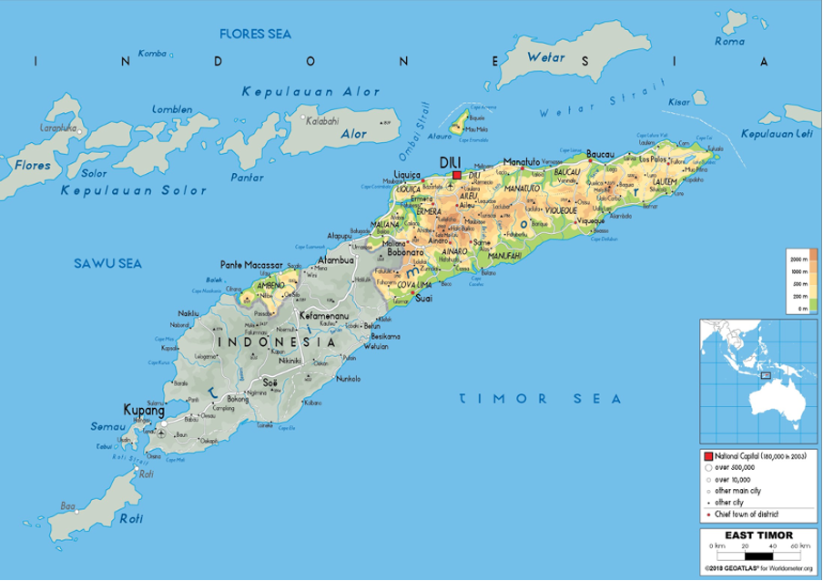
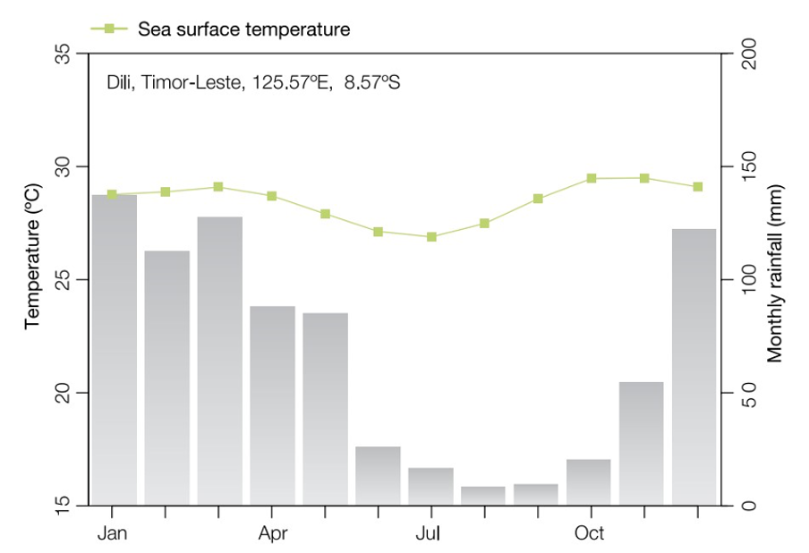
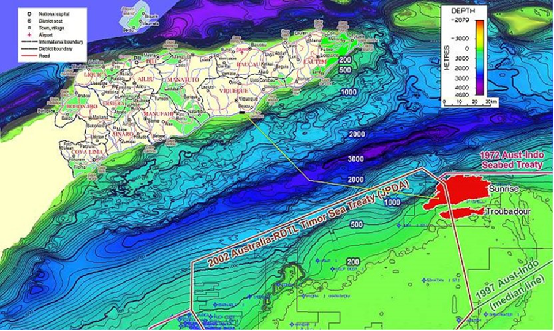
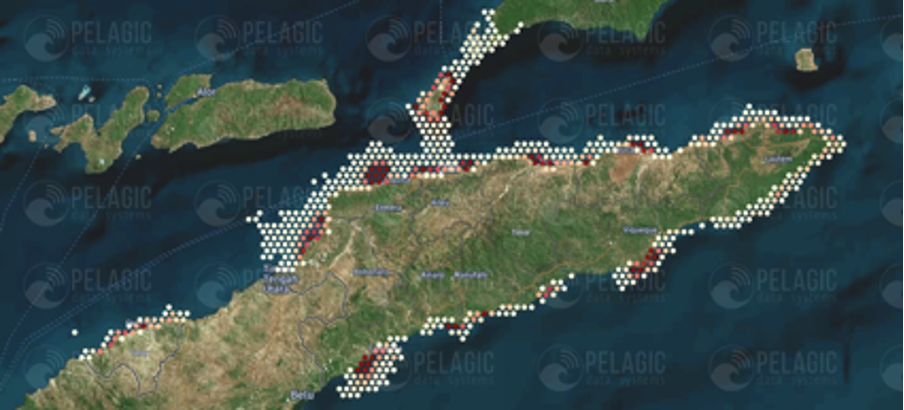

**Authors**

Sarah Jørgensen Veillat ^1^, Alexander Tilley^2,3^, Joctan Dos Reis Lopes^2^, E. Fernando Cagua^2^, Lorenzo Longobardi^2^, Jeppe Kolding^1^

**Authors' Affiliations**

1 University of Bergen

2 WorldFish, Penang, Malaysia

3 Università degli Studi di Ferrara, Italy

# **Executive Summary** {.unnumbered}

Small-scale fisheries (SSF) represent almost half of global capture fisheries production, supporting the livelihoods of millions of people worldwide, and the food and nutrition of billions. However, the lack of data from these fisheries makes it difficult to ensure their fair inclusion in decisions about ocean resources, and to manage resources for sustainability. 

Timor-Leste has one of the highest rates of malnutrition in the world, and fisheries are an important growth sector to achieve national development objectives of poverty alleviation and eradication of malnutrition. This report uses a four-year time series of the national fisheries monitoring system PeskAAS to provide a baseline characterisation and current state and trajectories of the fisheries of Timor-Leste. 

The national fisheries fleet of Timor-Leste is exclusively small scale, made up of \~XXX motorboats and XXX canoes. The climate and other livelihoods such as smallholder agriculture drive seasonal differences in fishing effort, with XX showing the highest effort, and XX the least. 

Fishing is predominantly nearshore, focused on fringing coral reef habitats with XX% of trips remaining within XXkm of the coast. Canoes are typically single person, and motorboats typically hold between one and twelve fishers depending on location and fishing type. The most common gear type is gill nets; the presence of large crocodiles throughout mainland Timor restricts most spearfishing activities to Atauro Island. 

...Include average annual catch statistics, description of most productive municipalities, species catch compositions, catch values,   

The results suggest that the SSF of Timor-Leste is quite resilient against the COVID-19 crisis. While experiencing a decline in the market value of the catch, it does not appear to have been as impactful as in other SSF, where a decrease in fishing effort has been measured as well. It is possible that the limited export and modest tourism sector of Timor-Leste have sheltered the fisheries from enduring the same shock that other SSF have. It will thus be important to put a significant amount of effort into preserving the resilience of the fisheries when promoting and developing the sector. This report contributes to filling the data gap present of small-scale fisheries, and hopefully incites an increase of descriptive analyses of SSF.

\
**List of acronyms**

**CPUE** Catch per unit effort

**ENSO** El Niño-Southern Oscillation

**FAD** Fish aggregating device

**GDP** Gross domestic product

**IOD** Indian Ocean Dipole

**PDS trackers** GPS trackers manufactured by Pelagic Data Systems Inc. (San Francisco, CA)

**PeskAAS** Tetum word for fisheries (Peskas) + Automated Analytics System

**SIDS** Small island developing state

**SSF** Small-scale fisheries

**SST** Sea surface temperature

# **How to use this report** {.unnumbered}

This report presents an analysis of fisheries catch and effort data generated through the PeskAAS fisheries monitoring system between March 2018 and March 2021. PeskAAS collects a sample of fish landings information from fishers at 15 landings sites across the country on a daily basis, and tracks the continual location of approximately 250 motor and unpowered vessels. Fisheries target species are compared with one another using an Index of Relative Importance (IRI), which combines the number of fish, their weight, and the frequency of occurrence in catches.

**Data protection and permissions**

All data provision is voluntary, and collection is conducted with the permission of fishers, and they have the option to not answer or to provide further data, or can request deletion of data we hold for their fishing activities.

# **Introduction**

Small-scale fisheries (SSF) are an important part of the global fish production, contributing around half of the total annual catch of capture fisheries [(World Bank, Fao and WorldFish, 2012)](https://paperpile.com/c/Yw05cY/DjXI). Of the several million people engaged in SSF, over 90% live in developing countries and small island developing states (SIDSs), for whom it is an essential source of food and income [(Mills et al., 2011; World Bank, Fao and WorldFish, 2012)](https://paperpile.com/c/Yw05cY/YKV9+DjXI).  In  some high income countries, where fisheries have been intensively monitored with quantitative data systems and governed by the state, monitoring has in some cases led to effective adjustments to management and fishing capacity so that fish stocks are recovering and/or fished at sustainable levels [(Hilborn et al., 2020)](https://paperpile.com/c/Yw05cY/jqJXW). The majority of the global SSF fleet isactive in low and middle income countries, with 80% in Asia [(FAO, 2020)](https://paperpile.com/c/Yw05cY/QUhAD), but are under increasing pressure to conform to data-driven management strategies [(Béné and Friend, 2011; Islam, 2011; Kolding and Van Zwieten, 2011; Kolding et al., 2014; Macusi et al., 2020)](https://paperpile.com/c/Yw05cY/5Ig0+XyZV+ELrm+IdOG+W28I). Fisher knowledge is critical in framing and evaluating fisheries-dependent data in a social-ecological context but is still too rarely incorporated effectively into   governance [(Hind, 2014)](https://paperpile.com/c/Yw05cY/47zNE). 

\
Fisheries present a  significant  challenge  for  quantitative  data  systems  because  the fish  are mobile and mostly invisible (underwater),  so  management  relies  principally  on  fisheries-dependent  data  (i.e.   data collected of fishing activities and landings etc.). Nevertheless, the dispersed and  diverse  operations  of  fishing  activities  and  the challenges  inherent  in  measuring  and  understanding  trends  in  mobile stocks,  place  demands and limitations on both fisheries-dependent monitoring. This is especially true for small-scale fisheries (SSF), which  are  often  informal,  dynamic and even more widely dispersed. As such, scientific management strategies are often based on limited information; this can do more harm than good if there is also limited integration of local knowledge, or understanding the social and cultural elements [(Kolding and Van Zwieten, 2011)](https://paperpile.com/c/Yw05cY/ELrm). Filling these gaps in our knowledge should be a priority, as to determine their level of resilience against crises and, if necessary, strengthen them.

\
Despite the formidable economic, social and geographical barriers that small-scale fisheries communities face in using technological approaches, such as the cost of equipment and the digital literacy to operate it, there has been a dramatic expansion of the development and testing of ICTs for small-scale fisheries [(Fujita et al., 2018; Bradley et al., 2019; FAO and WorldFish, 2020)](https://paperpile.com/c/Yw05cY/7HQZ+yV1N+2xWO). The PeskAAS fisheries monitoring system has improved and automated rapid, low-cost and accurate data generation for fisheries in Timor-Leste [(Dam Lam et al., 2022)](https://paperpile.com/c/Yw05cY/AzxG); enabled new income streams for women in SSF communities in Bangladesh through digital financial inclusion [(FAO and WorldFish, 2020, chap. 7)](https://paperpile.com/c/Yw05cY/2xWO/?locator_label=chapter&locator=7); brought about improved social cohesion through community-supported fisheries in South Africa [(Nthane et al., 2020; Stone, 2020)](https://paperpile.com/c/Yw05cY/sMgu+pOzr). Some fisheries apps have been developed by external agencies in South India, namely Fisher Friend (M.S. Swaminathan Research Foundation) and mKrishi (Tata Consulting Services). Both these  apps  provide  an  early  warning  system  for  severe weather and potential fishing zones for fishers based on  wind,  weather  and  other  environmental  parameters provided  by  the  Indian  National  Centre  for  Ocean Information  Services  (INCOIS) [(Singh et al., 2016; FAO and WorldFish, 2020, chap. 3)](https://paperpile.com/c/Yw05cY/2xWO+QP23/?locator_label=chapter,page&locator=3,)\

Timor-Leste, also known as East Timor, is a SIDS in Southeast Asia. The official languages are Portuguese and Tetum, but there are many other indigenous languages in use [(Taylor-Leech, 2009)](https://paperpile.com/c/Yw05cY/nOaa). It is at long-term high risk from the COVID-19 crisis due to its fragile economic and health conditions [(CARE, 2020)](https://paperpile.com/c/Yw05cY/yQgL). The country has only recently been declared a sovereign state by the United Nations in May 2002, after having suffered two brutal civil wars in 1979 and 1999 and a 24-year long occupation by Indonesia [(Braithwaite, Charlesworth and Soares, 2012; Ingram, Kent and McWilliam, 2015)](https://paperpile.com/c/Yw05cY/K6Lc+d9cp). These calamities have left the country with high poverty rates, poor health services and infrastructure, and 36% of the population experiencing chronic food insecurity due to low quality and quantities of food intake [(Casado and Alonso, 2019; National Directorate of Food Security and Cooperation, 2019; CARE, 2020)](https://paperpile.com/c/Yw05cY/yQgL+Qddk+SHFf). While during the Indonesian occupation the commercial fishery played a significant role in the economy of Timor-Leste, after the civil war in 1999 this completely plummeted as the infrastructure of the country was destroyed [(Barbosa and Booth, 2009)](https://paperpile.com/c/Yw05cY/F8V3). Hereafter, the SSF became the dominant fishery in Timor-Leste. Presently, the fish consumption of the Timorese population is low, both in the coastal communities as well as in the inland areas (17 and 5.2 kg/capita/year, respectively), especially compared to other SIDS in the Pacific (30--118 kg/capita/year in Melanesia, 62--115 kg in Micronesia and 50--146 kg in Polynesia) [(Mills et al., 2013; FAO, 2014; López Angarita et al., 2019)](https://paperpile.com/c/Yw05cY/WbAw+Al53+DYZP). Agriculture is responsible for most of the food production, with 90% of rural households engaged in it [(FAO, 2015; Ximenes et al., 2018)](https://paperpile.com/c/Yw05cY/FlVv+SVne). Most families involved in fishing have diverse livelihoods, where most of their time and energy is spent on agriculture and livestock farming [(Mills et al., 2013)](https://paperpile.com/c/Yw05cY/DYZP), but these livelihoods are dynamic and vary according to season and climate [(Mills et al., 2017)](https://paperpile.com/c/Yw05cY/SKw9X). \

WorldFish is a research institution focused on generating new knowledge to alleviate poverty and eliminate malnutrition by harnessing the potential of aquatic food systems. In 2016, as part of the Fisheries Sector Support Programme funded by Norway, WorldFish piloted a new catch and effort monitoring program, called PeskAAS, to generate new information about catch and effort of the small-scale fishing fleet [(Tilley, Dos Reis Lopes and Wilkinson, 2020)](https://paperpile.com/c/Yw05cY/Ywfq). PeskAAS is a pseudo-acronym, combining the Tetum word for fisheries (peskas) and the abbreviation for Automated Analytics System. It is an interactive web-hosted application in which one can access databases containing catch and trip records, with the goal of facilitating data exploration and decision-making processes for small-scale fisheries. In 2019, PeskAAS was formally adopted by the government as the official national fisheries monitoring system of Timor-Leste, and now forms part of the fisheries management process. 

This report aims to summarise and analyse the first 3 years of data collected by the PeskAAS national fisheries monitoring system of Timor-Leste to provide a series of benchmarks for the fisheries sector against which trends and trajectories can be compared in years to come. Furthermore, our report is intended to provide easily accessible and interpretable information for fisheries stakeholders (fishers, government, NGOs/CSOs) to guide new development and capacity building initiatives in the fisheries sector. 

While the impacts of the COVID-19 pandemic on fisheries is not a major focus of this report, the pandemic started during this data time series, so this is used as a reference point in certain analyses and a short discussion is included.

# **Study area**

Timor-Leste is surrounded by Indonesia to the west, north and east, and Australia to the south with the Timor Sea in between (fig. 2.1). It has a coastline of 783 km and a total land area of around 14,954 km2 [(Lopes et al., 2019)](https://paperpile.com/c/Yw05cY/5UXn). Atauro island, with a land area of around 140km2, has a population of around 10,000 [(General Directorate of Statistics, 2015; Lopes et al., 2019)](https://paperpile.com/c/Yw05cY/vg6Z+5UXn). The country counts around 1.3 million citizens which is expected to triple by 2050 [(Molyneux et al., 2012)](https://paperpile.com/c/Yw05cY/qknt). Most cities, including the capital Dili, are located on the north coast. Consequently, this is where the majority of the people are situated: over 60% of the total population lives on the north coast and around 20% on the south coast (General Directorate of Statistics, 2015). Most economic activity is centred around Dili, and the rural population experience higher poverty rates than people living in urban areas (Moxham & Carapic, 2013).

It has a tropical climate, with temperatures at the coast ranging from 25 to 30 degrees Celsius all year round and with a pronounced wet (December to May) and dry season (June to November) (fig. 2.2) [(Timor-Leste National Directorate of Meteorology and Geophysics, Australian Bureau of Meteorology and Commonwealth Scientific and Industrial Research Organisation (CSIRO), 2015)](https://paperpile.com/c/Yw05cY/T09Z). This seasonality pattern of the rainfall experiences between-year fluctuations, caused by the El Niño-Southern Oscillation (ENSO) and the Indian Ocean Dipole (IOD) [(Australian Bureau of Meteorology and Csiro, 2014)](https://paperpile.com/c/Yw05cY/1puf). The mountain range separating the northern coast of the southern (fig. 2.1) causes different rainfall patterns on the two coasts [(Asian Development Bank, 2014)](https://paperpile.com/c/Yw05cY/Bd1U). The seas on the south coast are rougher than on the north coast due to cyclones coming from the Indian Ocean. The south coast has a shallow slope, while the north coast has a very steep slope, quickly descending to several kilometres depth (fig. 2.3). The coral reefs are predominantly fringing reefs, located for the most part on the north coast and around Atauro island [(Asian Development Bank, 2014)](https://paperpile.com/c/Yw05cY/Bd1U). 

For the purpose of this study, the coastal municipalities were grouped into three statistical areas: Atauro island, the north coast, and the south coast (fig. 2.4: blue, yellow, and green, respectively). The landing sites of Manatuto and Lautém are located on the north coast and have therefore been assigned to the north coast strata, even though the municipalities border both coasts. The municipalities Ermera and Aileu do not have a coastline and are thus not included. These areas were chosen due to their difference in rainfall pattern, wave activity, marine landscape, and demographics mentioned above.

(ref:timormap) **Map of Timor-Leste and its surroundings.** The colours show the elevation from 0 meters above sea-level (green) to 2000+ meters above sea-level (orange brown). The size of the points show the size of the cities. The small map on the right side shows the placement of the country compared to the rest of Southeast Asia and Australia. Source: Geoatlas (2018)

(\#fig:timormap)(ref:timormap)

(ref:timorclimate) **Seasonal rainfall and sea surface temperature in Timor-Leste.** Seasonal rainfall and sea surface temperature in Timor-Leste, measured in Dili. Source: Timor-Leste National Directorate of Meteorology and Geophysics et al. (2015)

(\#fig:timorclimate)(ref:timorclimate)

(ref:timorbat) **Map of Timor-Leste and its surroundings.** The colours show the elevation from 0 meters above sea-level (green) to 2000+ meters above sea-level (orange brown). The size of the points show the size of the cities. The small map on the right side shows the placement of the country compared to the rest of Southeast Asia and Australia. Source: Geoatlas (2018)

(\#fig:timorbat)(ref:timorbat)

(ref:timormuni) **A map of Timor-Leste and its municipalities.** The dots represent the landing sites where catch and trip information were recorded\*. The colours represent the different strata: Atauro island (blue), north coast (yellow), and south coast (green). Source: Tilley et al. (2020). \*Not all landing sites are shown on this map, only the ones where enumerators are presently active.

(\#fig:timormuni)(ref:timormuni)

# Fishing fleet and gear

## **The sampled fishing fleet**

Of the 2277 fishing boats registered at the Timor-Leste Ministry of Agriculture and Fisheries (2018), 323 were used to report catch and/or tracking data to PeskAAS (table 1). The 323 sampled boats include both motorboats with in- or outboard motor and paddle canoes (table 2).

The differences seen in the characteristics of the fishing boats between the areas are likely influenced by social, geographical, economical and political factors. The north coast is where the capital Dili and most of the other cities are located, and where most of the economic activity is centred around, making it the richer region. Therefore, more people can invest in motorboats. By contrast, the more rural south coast, predominantly fishes in paddle-driven canoes, which is likely a result of the poor infrastructure and the higher poverty rates of that part of the country [(Braithwaite, Charlesworth and Soares, 2012; Moxham and Carapic, 2013; Ingram, Kent and McWilliam, 2015)](https://paperpile.com/c/Yw05cY/K6Lc+d9cp+mGGb). Investing in a motorboat will therefore likely not be an option for most. Furthermore, wooden boats can be locally made, whereas fibreglass boats have to be imported and/or be funded by the government. People would need to have contacts within the government or have strong Indonesian connections to be able to afford a fibreglass boat brought to Timor.

+:-------------:+:-----------------:+:----------------------------:+:-----------------:+
| **Region**    | **Sampled boats** | **Registered fishing boats** | **Boats sampled** |
+---------------+-------------------+------------------------------+-------------------+
| Atauro Island | 89                | 348                          | 25.6%             |
+---------------+-------------------+------------------------------+-------------------+
| North Coast   | 129               | 1463                         | 8.8%              |
+---------------+-------------------+------------------------------+-------------------+
| South Coast   | 105               | 466                          | 22.5%             |
+---------------+-------------------+------------------------------+-------------------+
| Total         | 323               | 2277                         | 14.2%             |
+---------------+-------------------+------------------------------+-------------------+

: **Total number of sampled and registered fishing boats per strata.** Information on the number of registered fishing boats was obtained from the Timor-Leste Ministry of Agriculture and Fisheries (2018).

+-----------------+-------------------+---------------+---------------------+----------------------------+---------------------------------+--------------------------------+
| **Region**      | **Sampled boats** | **Boat type** | **Number of boats** | **Median boat length (m)** | **Boat material**               | **Motor type**                 |
|                 |                   |               |                     |                            |                                 |                                |
|                 |                   |               |                     |                            | **fibreglass / wood / unknown** | **Inboard /Outboard /unknown** |
+:===============:+:=================:+:=============:+:===================:+:==========================:+:===============================:+:==============================:+
| **Atauro**      | 89                | Motorboat     | 48 (54%)            | 8.0                        | 3 (6.3%) /                      | 2 (4.2%) /                     |
|                 |                   |               |                     |                            |                                 |                                |
|                 |                   |               |                     |                            | 24 (50.0%) /                    | 46 (95.8%) /                   |
|                 |                   |               |                     |                            |                                 |                                |
|                 |                   |               |                     |                            | 21 (43.7%)                      | 0 (0%)                         |
+-----------------+-------------------+---------------+---------------------+----------------------------+---------------------------------+--------------------------------+
| \               | Paddle canoes     | 41 (46%)      | 5.0                 | 1 (2.4%) /                 | NA                              |                                |
|                 |                   |               |                     |                            |                                 |                                |
|                 |                   |               |                     | 31 (75.6%) /               |                                 |                                |
|                 |                   |               |                     |                            |                                 |                                |
|                 |                   |               |                     | 9 (22.0%)                  |                                 |                                |
+-----------------+-------------------+---------------+---------------------+----------------------------+---------------------------------+--------------------------------+
| **North Coast** | 129               | Motorboat     | 103 (80%)           | 6.0                        | 34 (33.0%) /                    | 35 (34.0%) /                   |
|                 |                   |               |                     |                            |                                 |                                |
|                 |                   |               |                     |                            | 55 (53.4%)/                     | 57 (55.3%) /                   |
|                 |                   |               |                     |                            |                                 |                                |
|                 |                   |               |                     |                            | 14 (13.6%)                      | 11 (10.7%)                     |
+-----------------+-------------------+---------------+---------------------+----------------------------+---------------------------------+--------------------------------+
| \               | Paddle canoes     | 26 (20%)      | 4.5                 | 0 (0%) /                   | NA                              |                                |
|                 |                   |               |                     |                            |                                 |                                |
|                 |                   |               |                     | 21 (80.8%) /               |                                 |                                |
|                 |                   |               |                     |                            |                                 |                                |
|                 |                   |               |                     | 5 (19.2%)                  |                                 |                                |
+-----------------+-------------------+---------------+---------------------+----------------------------+---------------------------------+--------------------------------+
| **South Coast** | 105               | Motorboat     | 30 (29%)            | 5.0                        | 4 (13.3%)/                      | 12 (40.0%) /                   |
|                 |                   |               |                     |                            |                                 |                                |
|                 |                   |               |                     |                            | 20 (66.7%)/                     | 14 (46.7%) /                   |
|                 |                   |               |                     |                            |                                 |                                |
|                 |                   |               |                     |                            | 6 (20%)                         | 4 (13.3%)                      |
+-----------------+-------------------+---------------+---------------------+----------------------------+---------------------------------+--------------------------------+
| \               | Paddle canoes     | 75 (71%)      | 4.0                 | 0 (0%) /                   | NA                              |                                |
|                 |                   |               |                     |                            |                                 |                                |
|                 |                   |               |                     | 65 (86.7%)/                |                                 |                                |
|                 |                   |               |                     |                            |                                 |                                |
|                 |                   |               |                     | 10 (13.3%)                 |                                 |                                |
+-----------------+-------------------+---------------+---------------------+----------------------------+---------------------------------+--------------------------------+
| **Total**       | 323               | Motorboat     | 181 (56%)           | 6.5                        | 41 (22.3%) /                    | 49 (26.6%) /                   |
|                 |                   |               |                     |                            |                                 |                                |
|                 |                   |               |                     |                            | 99 (53.8%) /                    | 117 (63.6%) /                  |
|                 |                   |               |                     |                            |                                 |                                |
|                 |                   |               |                     |                            | 44 (23.9%)                      | 18 (9.8%)                      |
+-----------------+-------------------+---------------+---------------------+----------------------------+---------------------------------+--------------------------------+
| \               | Paddle canoes     | 142 (44%)     | 4.0                 | 1 (0.7%) /                 | NA                              |                                |
|                 |                   |               |                     |                            |                                 |                                |
|                 |                   |               |                     | 117 (82.4%) /              |                                 |                                |
|                 |                   |               |                     |                            |                                 |                                |
|                 |                   |               |                     | 24 (16.9%)                 |                                 |                                |
+-----------------+-------------------+---------------+---------------------+----------------------------+---------------------------------+--------------------------------+

: Vessels reporting catch and/or tracking data to PeskAAS. Information on the number of registered fishing boats was obtained from the Timor-Leste Ministry of Agriculture and Fisheries (2018).

## **Fishing gear**

Gill nets are the most used gear on Atauro island (fig. 4.8) as well as the gear that catches the highest percentage of the catch in weight (64% and 88%, respectively) and numbers (71% and 96%, respectively). Spear guns, seine nets and hand lines also play a part in the fishery of Atauro island, collectively yielding 32% of the total weight of the catch and 28% of the total catch in numbers. The fishery of the north coast is also dominated by gill nets, catching 88% of the total catch in weight and 96% of the total catch in numbers (fig. 4.9). Hand lines are used somewhat frequently, but only results in a small part of the yield. On the south coast long lines are the most frequently used gear, catching 73% of the total catch in weight and 51% of the total catch in numbers (fig. 4.10). In addition, 14% and 10% of the total catch in weight and 18% and 27% of the total catch in numbers are caught by hand lines and gill nets, respectively. These differences in characteristics of the fishing gear used in the different areas are likely also influenced by social, economical and geographical factors, as well as climate and cultural factors. First of all, a particular fishing gear has to be available and preferably also commonly used in the area. If it is not a traditional fishing gear, it will be difficult to get access to the gear or to find someone who has experience fishing with it. For instance, Atauro island and the north coast have approximately the same marine habitat, with fringing reefs along the coast line followed by a steep slope, descending to several kilometres depth. However, the fishers on Atauro island catch less pelagic fish, as the gear needed to fish on the open ocean is uncommon on the island [(Mills et al., 2013)](https://paperpile.com/c/Yw05cY/DYZP). It also needs to be financially feasible for a fishing family to pay for the entry costs and the maintenance of certain fishing gears. The gear choice is also limited by the choice of fishing boats and the climate. The south coast experiences rougher weather conditions, and they will therefore not be able to go out very far on paddle-driven canoes or use heavy fishing gear. If, after having met all these conditions, a fisher is still left with options, the choice in fishing gear will likely be made according to desired targets, tradition, as well as revenue.

(ref:IRIGearGroups) **Gear composition of the three regions using the Index of Relative Importance (IRI).** Gear composition using the Index of Relative Importance (IRI) of the landings of Atauro island, north coast, and south coast from April 2018 to December 2021. The IRI considers the weight and the number of fish caught per gear type, and the frequency of occurrence (FRQ) of a gear type.

(\#fig:IRIGearGroups)(ref:IRIGearGroups)

# **Effort and landings**

## **Geospatial fishing effort**

Most of the fishing trips seem to be concentrated inshore around the coast and around the landing sites. This is probably because most marine productivity is in the surf zone, and thus where most fish can be found [(Alongi et al., 2009)](https://paperpile.com/c/Yw05cY/BwoM). There is some activity recorded between Atauro island and the mainland as well as to the Indonesian island Wetar, situated north of Atauro. These are most likely taxiing and trading trips, and not for fishing. The same is probably the case for the activity seen in the west part of the north coast, where they are headed to Indonesia or trade with Indonesian fishers at sea.

(ref:spatialeffort) **Heat map of Timor-Leste visualising the geospatial fishing effort.** A heat map of Timor-Leste visualising the geospatial fishing effort of 80,163 trips using the tracking information sampled by the PDS trackers during the period of February 2018 to July 2021. High effort is represented by red dots on the map, with orange to yellow to white representing a decreasing effort. Source: Pelagic Data Systems (2021).

(\#fig:spatialeffort)(ref:spatialeffort)

## **Number of trips per week**

The total number of trips per week was calculated using the trips sampled by the PDS trackers. Only a percentage of the total boats are being tracked, and therefore an estimation had to be made for the total number of fishing trips taken per week (equation 3.2):

Total number of trips per week = Number of trips tracked per week/Percentage of boats being tracked x 100

There are considerably more fishing trips taken per week on the north coast than on Atauro island and the south coast (fig. 4.22). This is a direct reflection of the north coast having the highest number of fishing boats registered and also where the majority of the population of Timor-Leste lives [(General Directorate of Statistics, 2015)](https://paperpile.com/c/Yw05cY/vg6Z). Within each stratum the number of fishing trips taken per week appear to remain quite constant over time.

## **Trip effort**

To calculate the trip effort the duration of a trip (hours) was multiplied with the number of fishermen (including women and children), resulting in an effort unit of fisher-hours.

The trip effort (fisher-hours) of the three strata appears to be quite similar (fig. 4.24a). The trip effort mostly ranges between two to ten fisher-hours, with some peaks reaching up to 28 fisher-hours. There seems to be no change in trip effort over time for Atauro island and the north coast, while the south coast shows a slight increase (fig. 4.24b).

(ref:TripEffort) **Mean trip effort.** The mean effort (fishermen \* hours) of a fishing trip in Atauro island (light blue), north coast (dark blue) and south coast (green) for the period of September 2016 to March 2021, with the regions plotted (a) together in one plot and (b) separately, where the y-axis has free scaling. The error bars represent the standard error. The dashed line shows the linear regression with 95% confidence intervals. The dotted red line signifies the start of the COVID-19 lockdown on 28 March 2020

(\#fig:TripEffort)(ref:TripEffort)

## **Catch per unit effort**

For this report, a standardised catch per unit effort (CPUE) was used, where the effort was standardised to one fisher and one trip hour (fisher-hour). The catch was calculated in kilograms. After 2019 the weight calculation was done on species level, while before 2019 it was more general.  

The CPUE (kg) of Atauro island and the north coast are quite similar, whereas the north coast has more high peaks (fig. 4.26). The south coast appears to generally have a lower CPUE (kg) than Atauro island and the north coast. The CPUE (kg) of Atauro island seems to increase over time. The north and south coast show no apparent change of CPUE over time.

\

(ref:CatchEffort) **Mean CPUE.** The mean catch (kg) per unit effort (fisher-hour) in Atauro island (grey), north coast (red) and south coast (light blue) for the period of April 2018 to December 2021, with the regions plotted (a) together in one plot and (b) separately, where the y axis has free scaling. The shaded area around the time series represent the 95% confidence interval. The line shows the local polynomial regression. The grey shaded area define the COVID-19 pandemic period, starting from the lockdown on 28 March 2020.

(\#fig:CatchEffort)(ref:CatchEffort)

to March 2021, with the strata plotted (a) together in one plot and (b) separately, where the y axis has free scaling. The error bars represent the standard error. The dashed line shows the linear regression with 95% confidence intervals. The dotted red line signifies the start of the COVID-19 lockdown on 28 March 2020.

## Catch composition

A total of at least 53 identified different species were caught, excluding the species classified under "unknown" and "other". To facilitate the data handling and to keep the results comprehensible, the species were divided into 10 functional groups: small pelagics, large pelagics, small demersal, large demersal, shark and rays, crustaceans, shrimp, cephalopods, molluscs and unknown (See Appendix B for a detailed list of the species classification).\
\
Atauro island shows the most diverse catch composition of the three sampling strata (fig. 4.12; fig. 4.13; fig. 4.14). It is dominated by small pelagics in weight and numbers, while small demersal are the most frequently caught. The catch composition of the north and the south coast are both dominated by small pelagic species. In the south coast the large pelagics are also caught relatively frequently (33%) and contribute to 31% of the weight of the catch (see Appendix F for the species composition of the catch within the functional groups).

Looking at the catch composition of the four most used gear types, it shows that gill nets catch primarily small pelagic species, both in weight and number (fig. 4.15). The weight of the catch of the hand line is dominated by large pelagics and large demersal, whereas the small pelagics dominate the catch in numbers (fig. 4.16). When long lines are used pelagic fish are primarily caught, of which large fish account for most of the weight of the catch, and small fish account for most of the catch in numbers (fig. 4.17). The catch of spear guns consists largely of demersal fish, with again the large fish accounting for most of the weight of the catch, and small fish accounting for most of the catch in numbers (fig. 4.18). Cephalopods are caught in one fifth of the fishing trips where spear guns are used.

The catch composition of each area is greatly influenced by the choice in gear type. The high frequency of occurrence of demersal fish in the catch of Atauro island reflects the scarcity of pelagic fishing gear on the island, as well as the use of spear guns. Both the south coast and Atauro island catch larger-sized fish than the north coast, which is likely due to their more common use of long lines, hand lines and spear guns.\
\

\

### **Catch composition by region**

This section presents information on the composition of fisheries catches across all gear types in each of the three main regions.

(ref:IRIFishGroups) **Catch composition on the three regions using the Index of Relative Importance (IRI).** Catch composition using the Index of Relative Importance (IRI) of the landings of Atauro island, north coast, and south coast for the period of April 2018 to December 2021. The IRI considers the weight, the number, and the frequency of occurrence (FRQ) of a functional group.

(\#fig:IRIFishGroups)(ref:IRIFishGroups)

### **Catch composition by gear type**

This section presents information on the composition of catches according to each gear type.

(ref:IRIFishGear) **Catch composition of the four main gear types using the Index of Relative Importance (IRI)** Catch composition using the Index of Relative Importance (IRI) of the landings of gill nets, hand lines, long lines, and spear guns for the period of April 2018 to December 2021. The IRI considers the weight, the number, and the frequency of occurrence (FRQ) of a functional group.

(\#fig:IRIFishGear)(ref:IRIFishGear)

### **Length composition of functional groups**

The small pelagics and the cephalopods caught on Atauro island appear to be marginally bigger than on the north and south coast, whereas the large demersal caught on the south coast seem slightly bigger than on Atauro island and the north coast (fig. 4.20).

(ref:LengthArea) **Length composition of the functional groups.** Violin plots of the length (cm) of the catch for every functional group for Atauro island (grey), north coast (red) and south coast (light blue). The y-axis has free scaling for every functional group. The dot represents the median and the variance bars the first and third quartile.

(\#fig:LengthArea)(ref:LengthArea)

## **Total monthly landings**

The total monthly landings was calculated using the mean monthly CPUE (in metric tons), the median monthly trip effort and the number of trips taken per month.

The estimated total monthly landings (tons) of the north coast are generally higher and with more peaks than on Atauro island and the south coast (fig. 4.28). This difference between the areas is largely driven by the difference in trips taken per week. The high peaks observed at the north coast are also seen in the CPUE, and could be actual windfall catches of sardines, which are the primary species of small pelagics caught on the north coast. These fish often migrate in large schools, which can result in big hauls if one comes across such a school [(Hunnam et al., 2021)](https://paperpile.com/c/Yw05cY/sLRG). This hyporeport is strengthened by the fact that these observed high catches occur during the wet season, when sardines are mostly present [(Hunnam et al., 2021)](https://paperpile.com/c/Yw05cY/sLRG). The use of FADs could also play a role in the fluctuations present, as fishing near one increases the chances of encountering big schools of fish [(Tilley et al., 2019)](https://paperpile.com/c/Yw05cY/APpV).

The landings seem to increase over time on the south coast, while remaining constant on Atauro island and north coast. The increase in landings observed on the south coast is likely due to the increase in trip effort. However, the first years of the south coast were poorly sampled (only two stations were sampled on the entire south coast up until May 2019), which could explain this trend. 

\

(ref:MonthlyCatch) **Estimate of total monthly catch (tons).** Estimate of the total monthly catch (tons) for Atauro island (light blue), north coast (dark blue) and south coast (green), during the period of February 2018 to March 2021, with the regions plotted (a) together in one plot and (b) separately, where the y axis has free scaling. The dashed line shows the linear regression with 95% confidence intervals. The dotted red line signifies the start of the COVID-19 lockdown on 28 March 2020.

## **Seasonality**

A pattern of seasonality is observed for the total number of trips taken per week as well as for the estimated total monthly landings in all three strata, with the strongest trend seen in the south coast (fig. 4.23). The total number of trips per week decreased around April/May and increased again around September/October.

This pattern of seasonality is likely explained by the weather conditions, as well as due to the diverse livelihood of most Timorese households. The fishers on the south coast make less trips when the seas are at their roughest, from April to September [(Tomascik et al., 1997)](https://paperpile.com/c/Yw05cY/45us). The seasonality in fishing activity seen on Atauro island are in line with the findings of [(Mills et al., 2017)](https://paperpile.com/c/Yw05cY/SKw9X), who found that there was reduced fishing activity in August and the months around August due to the rough seas caused by the south-easterly monsoon.

Fishing is for many households however not their only or even primary source of income [(Mills et al., 2013)](https://paperpile.com/c/Yw05cY/DYZP). Instead, the vast majority stated that crops and livestock were their main economic activity. It would therefore not be bold to assume that the seasonality of agricultural activities has an influence on the fishing activity. The harvesting of the two primary crops, maize and rice, happens from February to April and April to July [(FAO, 2021)](https://paperpile.com/c/Yw05cY/bxXs). The period with the highest food insecurity is in the months before the harvesting, which is also when we see the highest fishing activity on the mainland [(Gorton, 2018)](https://paperpile.com/c/Yw05cY/3tCT). This pattern is less prevalent on Atauro island, where there is a stronger fishing culture and half of the fishers consider it to be their main livelihood [(Mills et al., 2017)](https://paperpile.com/c/Yw05cY/SKw9X)).

(ref:WeekTrips) **Seasonality of trips per week** Box plots of the estimated number of trips per week for every month (2018-2021) for Atauro island, north coast, and south coast. The y-axis has a free scale for each stratum. The dashed line shows a loess regression with 95% confidence intervals.

(\#fig:WeekTrips)(ref:WeekTrips)

(ref:WeekCatch) **Seasonality of total monthly catch (tons).** Box plots of the estimated total catch (tons) for every month (2018-2021) for Atauro island, north coast, and south coast. The y-axis has a free scale for each stratum. The dashed line shows the loess regression with 95% confidence intervals.

(\#fig:WeekCatch)(ref:WeekCatch)

# Market

## **Fisheries catch usage**

When looking at the data, the use of the catch and the market value, it is important to keep in mind that the information is acquired before the selling has taken place. It is a prediction made by the fisher and does not necessarily align with reality. These assumptions are however made on prior knowledge and thus if a fisher sold less fish and for a low price for a longer period of time, the assumption will be made that the next catch will follow this pattern. The catch is usually sold on the road, on the water (e.g. to Indonesian fishers/traders), or to a trader, which then sells the fish on the market [(Población, 2013)](https://paperpile.com/c/Yw05cY/kST0). Selling the catch to traders is the safest option however less profitable than if sold directly to the consumer. Fishers will try to sell as much of their catch as they can and keep what is left.

On average, 96.2% of the sampled catch on Atauro island is sold on the market, 3.4% is kept for own consumption and 0.4% is used for both (fig. 4.30). On the north coast, 56.5% goes to the market, 1.8% is used for own consumption and 41.7% is used for both. On the south coast 91.7% is sold on the market, 2.0% is kept for own consumption and 6.3% is used for both. The amount (kg) used for own consumption does not appear to change over time (fig. 4.31). An interesting difference between the strata is that at the north coast a large part of the catch is documented as being used for both own consumption as well as being sold. While this is likely also the case on Atauro island and the south coast, it is not being documented in the same manner. Why there is this difference in documenting between the strata is not clear. It could be that the fishers of the north coast are more realistic with the outcome of the selling, or that the fishers of Atauro island and the south coast have a better understanding of which fish will sell and which will not and therefore can be more precise in their answering. It could also be because of a difference in the nuance of the question asked by the enumerators. 

Most of the fish being kept for own consumption are smaller sized fish and fish species, with some exceptions such as the Cobia (Rachycentron canadum) and the Moray eel (Gymnothorax spp.) (fig. 4.32; fig. 4.33). Large-size fish and fish species are often easier to sell, as they look more appetising and are in demand by the restaurants and urban population (Venugopa & Shahidi, 1995). 

\
(ref:Usage) **Destination of catch over time.** The mean weight (kg) per week of the sampled catch being sold on market, kept for own consumption, or both on Atauro island (light blue), north coast (dark blue), and south coast (green) in the period of September 2016 to March 2021. The dotted red line signifies the start of the COVID-19 lockdown on 28 March 2020. The y-axis has free scaling.

(\#fig:Usage)(ref:Usage)

(ref:UsageProp) **Bar plot of the destination of the catch per species.** The y-axis shows individual species grouped by functional group and the x-axis shows the percentage of the catch in weight (kg) being sold on the market (brown), held for own consumption (light green), or used for both (grey)

(\#fig:UsageProp)(ref:UsageProp)

(ref:LengthUsage) **Bar plot of the destination of the catch per length groups.** (a) Percentage of the catch and (b) weight (kg) of the catch being used to sell on market (light blue), for own consumption (dark blue), or both (green) versus the size (cm) of the fish caught. The catch is divided into 50 length groups. Entries without any information on the destination of the catch are shown in red.\

(\#fig:LengthUsage)(ref:LengthUsage)

## **Market value of catch**

To analyse the market value of the catch, the dataset was subset to only include catches which destination was to be sold on the market. 

\
The catch in hand lines yields the highest price (USD) per kg of the different gear types, followed by long lines (fig. 4.35). Gill nets and spear guns generate the lowest price per kg.

In the peskAAS dataset, the market value of the catch was given per fishing trip instead of per caught species. To be able to estimate the market value per functional group, the data was filtered to only include trips where the weight of the catch consisted of at least 95% of one functional group. The assumption was made that the 5% weight of the other species or functional group in the catch was negligible with respect to the market value of the entire catch of that fishing trip.

This considering, the large pelagics and large demersal yield the highest price (USD) per kg Of the different functional groups (fig. 4.36). The cephalopods bring in the lowest price per kg, followed by the small pelagics and small demersal. As larger-sized fish look more appetising and are more in demand, it makes sense that they would sell for the highest price per kg. 

\
The selling price (in USD) per kg of the catch is highest in the south coast, followed by the north coast and lastly Atauro island (fig. 4.34). This could possibly be because the south coast is home to larger fish species. However, it is still somewhat counter-intuitive. The south coast has poor infrastructure and is located further from the places with high demand (such as Dili), and you would therefore expect the traders to pay less as they need to compensate for the costs made for transport facilities and preservation of the produce [(Población, 2013)](https://paperpile.com/c/Yw05cY/kST0). Atauro island selling for the lowest price per kg is also doubtful. According to [(Mills et al., 2017)](https://paperpile.com/c/Yw05cY/SKw9X), fish from Atauro island has a higher standing among the Dili-based middle class, as well as easy accessibility. Fishers from Atauro island also do not appear too worried about being able to sell their catch [(Mills et al., 2017)](https://paperpile.com/c/Yw05cY/SKw9X). One should anyhow be hesitant in making a comparison between the strata, as there have been differences in how the enumerators record the pricing between the areas and over time.

(ref:MarketValue) **Mean market value (USD) per kg of the catch.** Mean market value (USD) per kg of the catch for Atauro island (light blue), north coast (dark blue) and south coast (green), during the period of July 2019 to April 2021. The error bars represent the standard error. The dashed line shows the linear regression with 95% confidence intervals for each stratum. The dotted red line signifies the start of the COVID-19 lockdown on 28 March 2020.

(\#fig:MarketValue)(ref:MarketValue)

(ref:ValueGear) **Mean market value (USD) per kg of the catch of the most used gear types.** Mean market value (USD) per kg of the catch in gill nets, hand lines, long lines, and spear guns during the period of July 2019 to April 2021. The error bars represent the standard error. The dotted red line signifies the start of the COVID-19 lockdown on 28 March 2020. The y-axis has free scaling for every gear type.

(\#fig:ValueGear)(ref:ValueGear)

(ref:ValueFish) **Mean market value (USD) per kg of the catch of the most frequently caught functional groups** in Atauro Island (light blue), north coast (dark blue) and south coast (green), during the period of July 2019 to April 2021. The error bars represent the standard error. The y-axis has free scaling for every functional group. The dotted red line signifies the start of the COVID-19 lockdown on 28 March 2020.

(\#fig:ValueFish)(ref:ValueFish)

